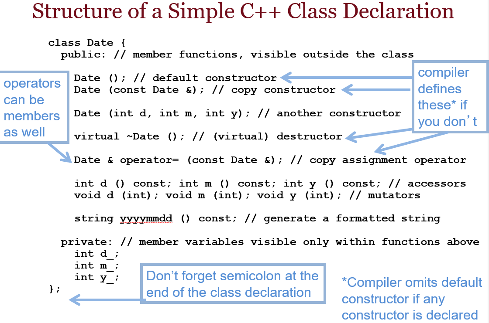

### 复习材料：C++ 类与结构体 (第六章)

---

#### **1. 类与结构体的区别**

- **结构体（`struct`）**：默认情况下，结构体的成员是 `public` 的。适合用于简单的数据存储，不需要过多的封装。
- **类（`class`）**：默认情况下，类的成员是 `private` 的。适合用于复杂的数据封装，支持继承、多态等特性。

**示例**：
```cpp
struct Point {
    int x;
    int y;
};
```
```cpp
class Point {
private:
    int x;
    int y;
public:
    Point(int xVal, int yVal) : x(xVal), y(yVal) {}
};
```

### **2. 构造函数**

构造函数是一种特殊的成员函数，用于在对象创建时初始化对象的状态。构造函数与类同名，没有返回类型。

**构造函数类型**：
1. **默认构造函数**：不带参数的构造函数。
2. **参数化构造函数**：带参数的构造函数。
3. **拷贝构造函数**：用于创建对象的副本。
4. **移动构造函数**：用于从右值引用中移动数据。

**构造函数初始化列表**：用于在构造对象时初始化成员变量，尤其是常量或引用类型。

**语法**：
```cpp
class MyClass {
public:
    MyClass(int a, int b) : x(a), y(b) {}  // 使用初始化列表
private:
    int x;
    int y;
};
```

---

#### **3. 构造函数的类型与使用场景**

**（1）默认构造函数**：

默认构造函数是没有参数的构造函数，它在对象被创建时自动调用，用于初始化对象的成员变量。

**示例**：
```cpp
class MyClass {
public:
    MyClass() : x(0), y(0) {}  // 默认构造函数，将 x 和 y 初始化为 0
private:
    int x;
    int y;
};
```

**（2）参数化构造函数**：

参数化构造函数用于在对象创建时传递参数，初始化成员变量。

**示例**：
```cpp
class MyClass {
public:
    MyClass(int xVal, int yVal) : x(xVal), y(yVal) {}  // 参数化构造函数
private:
    int x;
    int y;
};
```

**（3）拷贝构造函数**：

拷贝构造函数用于根据已有的对象创建新对象。拷贝构造函数的参数是该类的一个常量引用。

**示例**：
```cpp
class MyClass {
public:
    MyClass(const MyClass& other) : x(other.x), y(other.y) {}  // 拷贝构造函数
private:
    int x;
    int y;
};
```

**（4）移动构造函数**：

移动构造函数用于从右值引用中移动数据，以避免不必要的深拷贝。它的参数是该类的右值引用。

**示例**：
```cpp
class MyClass {
public:
    MyClass(MyClass&& other) : x(other.x), y(other.y) {
        other.x = 0;  // 移动后将原对象的值置为默认值
    }
private:
    int x;
    int y;
};


```


---

#### **4. 成员函数与访问控制**

类的成员函数用于操作对象的数据，通常有以下几种访问控制：

- **`private`**：只能在类内部访问。
- **`protected`**：只能在类内部或派生类中访问。
- **`public`**：可以在任何地方访问。

**示例**：
```cpp
class MyClass {
private:
    int x;
public:
    int getX() const { return x; }  // 公有成员函数，可以在外部访问
};
```

---

#### **5. 编译器提供的默认成员函数**

如果用户没有明确定义，编译器会自动为类生成以下成员函数：
1. **默认构造函数**。
2. **拷贝构造函数**。
3. **拷贝赋值运算符**。
4. **析构函数**。

**当用户定义了自定义构造函数时，编译器将不会自动生成默认构造函数，除非显式声明 `= default;`**。

---

#### **6. const 修饰符**

在类中，可以使用 `const` 关键字修饰成员函数，以表示该函数不会修改对象的状态。`const` 成员函数只能调用其他 `const` 成员函数。

**示例**：
```cpp
class MyClass {
private:
    int x;
public:
    int getX() const { return x; }  // const 成员函数
};
```

---

### **7. Studio 6 实践与问题总结**

**Q2 - 编译警告与构造函数的作用**：
在没有构造函数时，成员变量未被初始化，会产生编译器警告。通过添加默认构造函数，可以显式地将成员变量初始化为 0，消除未初始化的风险。

```cpp
MyClass::MyClass() : x(0), y(0) {}
```

**Q3 - struct 和 class 的访问控制**：
struct 默认是 `public`，而 class 默认是 `private`。如果没有指定访问控制，类成员变量将无法被外部访问，需要显式声明 `public`。

**Q4 - Getter 和 Setter 函数**：
为了保证封装性，类中通常会将成员变量设置为 `private`，然后通过 `public` 的 getter 和 setter 函数来访问和修改这些变量。

```cpp
int MyClass::getX() const { return x; }
MyClass& MyClass::setX(int xVal) { x = xVal; return *this; }
```

**Q5 - 拷贝构造函数与赋值运算符**：
在涉及到对象副本的操作中，拷贝构造函数和赋值运算符发挥重要作用。编译器提供的默认拷贝构造函数是浅拷贝，适用于简单类型。

---

### **考题示例**

**考题示例 1**：  
_“What is the difference between `struct` and `class` in C++?”_

**答案**：  
- `struct` 的默认访问控制是 `public`，而 `class` 的默认访问控制是 `private`。
  
---

**考题示例 2**：  
_“How do you declare a default constructor in a C++ class?”_

**答案**：  
```cpp
class MyClass {
public:
    MyClass() : x(0), y(0) {}  // 默认构造函数
private:
    int x, y;
};
```

---

**考题示例 3**：  
_“What is a copy constructor, and when is it used?”_

**答案**：  
拷贝构造函数用于根据已有对象创建新对象，通常在对象被传递到函数或从函数返回时使用。

